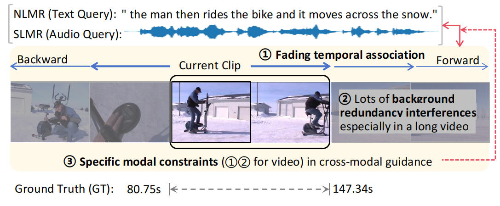
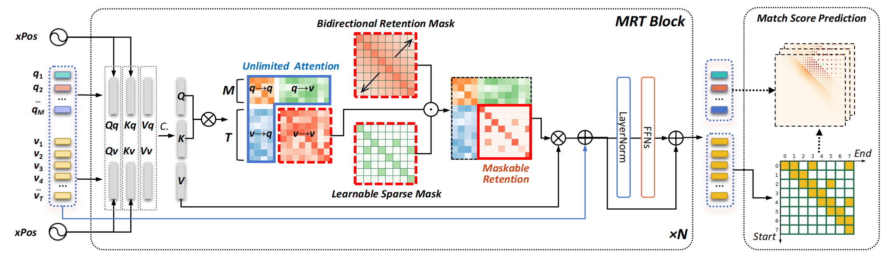

# Maskable Retentive Network for Video Moment Retrieval

Source code for our [ACM MM 2024 paper](https://openreview.net/forum?id=pIHHAUa500)

**Task Example:** The goal of both MR tasks NLMR (_natural language moment retrieval_) and SLMR (_spoken language moment retrieval_) is to predict the temporal boundaries $(\tau_{start}, \tau_{end})$ of target moment described by a given query $q$ (_text or audio modality_).

<p align="center">
 
</p>

```
 Two important characteristics:
 1) Temporal association between video clips: The temporal correlation between two video clips that are farther apart is weaker;
 2) Redundant background interference: The background contains a lot of redundant information that can interfere with the recognition of the current event, and this redundancy is even worse in long videos.
```
----------
## Approach

The architecture of the Maskable Retentive Network (MRNet). We conduct modality-specific attention modes, that is, we set _Unlimited Attention_ for language-related attention regions to maximize cross-modal mutual guidance, and perform a new _Maskable Retention_ for video branch $\mathcal{A}(v\to v)$ for enhanced video sequence modeling. 

<div align="center">
  
</div>


----------

## Download and prepare the datasets

**1. Download the datasets (Optional).** 
   
* The [video feature](https://rochester.app.box.com/s/8znalh6y5e82oml2lr7to8s6ntab6mav)  provided by [2D-TAN](https://github.com/microsoft/2D-TAN)
    
        ActivityNet Captions C3D feature
        TACoS C3D feature

    
* The video I3D feature of Charades-STA dataset from [LGI](https://github.com/JonghwanMun/LGI4temporalgrounding)
     
        wget http://cvlab.postech.ac.kr/research/LGI/charades_data.tar.gz
        tar zxvf charades_data.tar.gz
        mv charades data
        rm charades_data.tar.gz


* The Audio Captions: ActivityNet Speech Dataset: download the [original audio](https://drive.google.com/file/d/11f6sC94Swov_opNfpleTlVGyLJDFS5IW/view?usp=sharing) proposed by [VGCL](https://github.com/marmot-xy/Spoken-Video-Grounding)

**2. For convenience, the extracted input data features can be downloaded directly from [baiduyun, passcode:d4yl](https://pan.baidu.com/share/init?surl=FLzAPACOfcK_xDewZoXAkg&pwd=d4yl)**


**3. Text and audio feature extraction (Optional).** 

```
 cd preprocess
 python text_encode.py
 python audio_encode.py
```

**4. Set your own dataset path in the following .py file.**

      ret/config/paths_catalog.py


**5. Or prepare the files in the following structure (Optional).**
   
      MRNet
      ├── configs
      ├── dataset
      ├── ret
      ├── data
      │   ├── activitynet
      │   │   ├── *text features
      │   │   ├── *audio features
      │   │   └── *video c3d features
      │   ├── charades
      │   │   ├── *text features
      │   │   └── *video i3d features
      │   └── tacos
      │       ├── *text features
      │       └── *video c3d features
      ├── train_net.py
      ├── test_net.py
      └── ···


## Dependencies

    pip install yacs h5py terminaltables tqdm librosa transformers
    conda install pytorch==1.11.0 torchvision==0.12.0 torchaudio==0.11.0 cudatoolkit=11.3 -c pytorch


## Training

For training, run the python instruction below:

```
python train_net.py --config-file checkpoints/best/xxxxxxx/config.yml 
```

## Testing 

### ActivityNet

 1) download the model weight file from [Google Drive](https://drive.google.com/drive/folders/1wSnpo4CptQUV2BALX5TNPRqa505OY70k?usp=sharing) to the `checkpoints/best/activity` folder
 2) `python test_net.py --config-file checkpoints/best/activity/config.yml   --ckpt   checkpoints/best/activity/pool_model_14.pth`

### TACoS

 1) download the model weight file from [Google Drive](https://drive.google.com/drive/folders/1yAkpu-hSL1nW9uPzKb4cH4dqMY985A4E?usp=sharing) to the `checkpoints/best/tacos` folder
 2) `cd ret/modeling/ret_model`, then copy the code in file `ret_model_tacos.py` to file `ret_model.py`.
 3) `python test_net.py --config-file checkpoints/best/tacos/config.yml   --ckpt   checkpoints/best/tacos/pool_model_110e.pth`

### Charades

 1) download the model weight file from [Google Drive](https://drive.google.com/drive/folders/1jUPXbhGTE5N9--W4iTi709956DrTkEPA?usp=sharing) to the `checkpoints/best/charades` folder
 2) `cd ret/modeling/ret_model`, then copy the code in file `ret_model_charades.py` to file `ret_model.py`.
 3) `python test_net.py --config-file checkpoints/best/charades/config.yml   --ckpt   checkpoints/best/charades/pool_model_11e.pth`


## LICENSE
The annotation files and many parts of the implementations are borrowed from [MMN](https://github.com/MCG-NJU/MMN).
Our codes are under [MIT](https://opensource.org/licenses/MIT) license.

